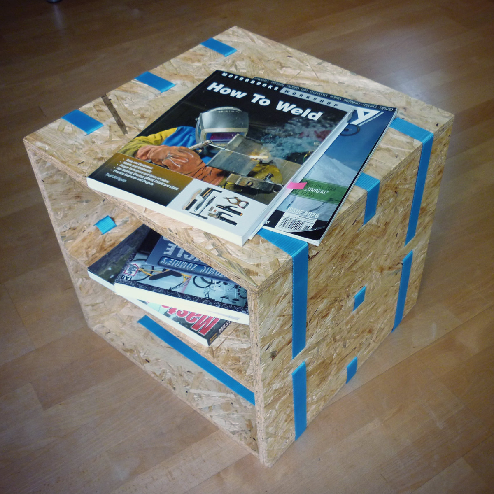

## Beistelltisch »Zurrgurt«

15 mm OSB-Platte, zusammengehalten von drei Spanngurten

Abmessungen: 40 cm × 40 cm × 40 cm.

#### Lizenz

Dieses Werk ist lizenziert unter einer [Creative Commons Namensnennung - Weitergabe unter gleichen Bedingungen 4.0 International Lizenz](http://creativecommons.org/licenses/by-sa/4.0/).
